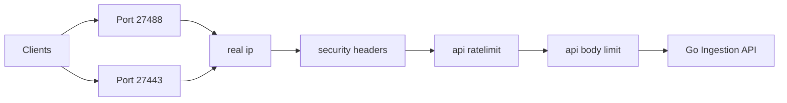
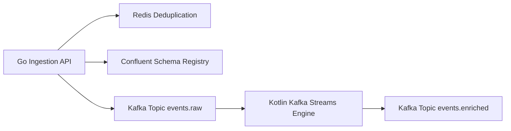
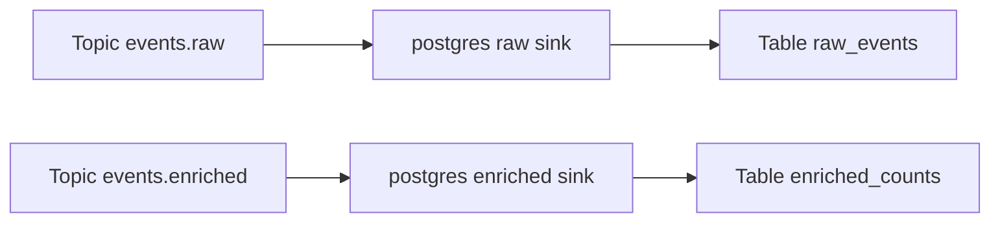
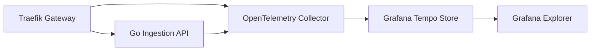

# High-Throughput Event Ingestion & Stream Processing Pipeline — Traefik Integrated

A production-grade, enterprise event processing platform built to sustain high-throughput ingestion, zero-data-loss streaming, real-time aggregation, and relational database archiving on minimum compute resources, reverse-proxied and managed by **Traefik v3**.

---

## 🌐 1. Network Pipeline & Edge Ingress

The Network Pipeline governs edge traffic entry, SSL/TLS termination, request routing, rate limiting, payload size validation, and authentication before reaching internal application services.

### In-Depth Visual Architecture Diagram

```
┌─────────────────────────────────────────────────────────────────────────────────────────┐
│                               1. EDGE TRAFFIC ENTRY POINT                               │
│     HTTP Client / Browser (Port 27488)           HTTPS Client / SSL (Port 27443)        │
└──────────────────────────────────────────┬──────────────────────────────────────────────┘
                                           │
                                           ▼
┌─────────────────────────────────────────────────────────────────────────────────────────┐
│                           2. TRAEFIK V3 INGRESS GATEWAY ENGINE                          │
│                                                                                         │
│  ┌──────────────────────┐  ┌──────────────────────┐  ┌───────────────────────────────┐  │
│  │ 1. real-ip           │  │ 2. security-headers  │  │ 3. api-ratelimit              │  │
│  │ Check CIDR Whitelist │─►│ HSTS, FrameDeny,     │─►│ Token-Bucket Rate Limiter     │  │
│  │ [127.0.0.1, 10.0..]  │  │ Nosniff, X-XSS       │  │ [200 req/s avg, 500 burst]    │  │
│  └──────────────────────┘  └──────────────────────┘  └──────────────┬────────────────┘  │
│                                                                     │                   │
│  ┌──────────────────────┐  ┌──────────────────────┐                 │                   │
│  │ 5. grafana-auth      │  │ 4. api-body-limit    │◄────────────────┘                   │
│  │ BasicAuth Check      │  │ Max Request Payload  │                                     │
│  │ [admin / Scaibu@123] │  │ [10 MB Byte Cap]     │                                     │
│  └──────────┬───────────┘  └──────────┬───────────┘                                     │
└─────────────┼─────────────────────────┼─────────────────────────────────────────────────┘
              │                         │
              ▼                         ▼
┌───────────────────────────┐ ┌───────────────────────────────────────────────────────────┐
│ Grafana Dashboard (:27402)│ │ Go Ingestion API Cluster (Port 27480 / Internal :8080)    │
└───────────────────────────┘ └───────────────────────────────────────────────────────────┘
```



### Deep Technical Specifications
- **Traefik Entrypoints**: Port `27488` (HTTP) and Port `27443` (HTTPS with self-signed TLS certificate fallback).
- **Virtual Host Routing**:
  - `Host("api.scaibu.localhost")` routes directly to `ingestion-api:8080`.
  - `Host("grafana.scaibu.localhost")` routes to `grafana:3000` protected by BasicAuth.
  - `PathPrefix("/dashboard")` routes to internal Traefik administration API (`api@internal`).
- **Middlewares & Security Policy**:
  - `real-ip`: Enforces client IP matching against trusted CIDR ranges (`127.0.0.1/8`, `10.0.0.0/8`, `172.16.0.0/12`, `192.168.0.0/16`).
  - `security-headers`: Sets `X-Frame-Options: DENY`, `X-Content-Type-Options: nosniff`, and `Strict-Transport-Security`.
  - `api-ratelimit`: Token-bucket algorithm allowing 200 average requests/sec with burst limit of 500 requests/sec.
  - `api-body-limit`: Hard payload threshold of 10 MB (`10,485,760 bytes`).

---

## ⚡ 2. Messaging & Streaming Pipeline

The Messaging Pipeline guarantees high-throughput event validation, fast Redis deduplication, schema compatibility verification via Schema Registry, and real-time stream aggregation using Kafka Streams.

### In-Depth Visual Architecture Diagram

```
┌─────────────────────────────────────────────────────────────────────────────────────────┐
│                           1. INGESTION & DEDUPLICATION ENGINE                           │
│                                                                                         │
│    ┌──────────────────────────────┐        SETNX dedup:<event_id> 1 (TTL 24 Hours)     │
│    │ Go Ingestion API (:27480)    │───────────────────────────────────────────┐         │
│    └──────────────┬───────────────┘                                           │         │
│                   │                                                           ▼         │
│                   │ Fetch Schema ID                            ┌────────────────────────┐ │
│                   ▼                                            │ Redis Cache (:27479)   │ │
│    ┌──────────────────────────────┐                            │ Duplicate Check: 202   │ │
│    │ Confluent Schema Registry    │                            └────────────────────────┘ │
│    │ (:27481 / Internal :8081)    │                                                     │
│    └──────────────┬───────────────┘                                                     │
└───────────────────┼─────────────────────────────────────────────────────────────────────┘
                    │ Wire Format: Magic Byte (0x00) + 4-Byte Schema ID + Avro Binary Payload
                    ▼
┌─────────────────────────────────────────────────────────────────────────────────────────┐
│                       2. KAFKA STREAMING & WINDOW AGGREGATION                           │
│                                                                                         │
│    ┌───────────────────────────────────────┐                                            │
│    │ Kafka Topic: events.raw               │                                            │
│    │ Partitions: 12 | Compression: LZ4     │                                            │
│    └──────────────────┬────────────────────┘                                            │
│                       │ Consume Stream                                                  │
│                       ▼                                                                 │
│    ┌───────────────────────────────────────┐                                            │
│    │ Kotlin Kafka Streams Processor        │                                            │
│    │ 1-Minute Tumbling Aggregation Window  │                                            │
│    └──────────────────┬────────────────────┘                                            │
│                       │ Output Window Totals                                            │
│                       ▼                                                                 │
│    ┌───────────────────────────────────────┐                                            │
│    │ Kafka Topic: events.enriched          │                                            │
│    │ Partitions: 12 | Key: event_type      │                                            │
│    └───────────────────────────────────────┘                                            │
└─────────────────────────────────────────────────────────────────────────────────────────┘
```



### Deep Technical Specifications
- **Deduplication Engine**: Executes atomic Redis `SETNX dedup:<event_id> 1` with a 24-hour key TTL. Duplicate event IDs are dropped immediately and acknowledged with `202 Accepted`.
- **Wire Serialization**: Encodes JSON payloads into Confluent Avro wire format (`0x00` magic byte + 4-byte Schema ID + Avro binary buffer).
- **Topic Configuration**:
  - `events.raw`: 12 partitions, replication factor 1, LZ4 compression, partition key `event_id`.
  - `events.enriched`: 12 partitions, replication factor 1, partition key `event_type`.
- **Kafka Streams Aggregation**: Kotlin application applies a 1-minute tumbling window, groups events by `event_type`, calculates total occurrences, and emits window totals to `events.enriched`.

---

## 💾 3. Data & Storage Pipeline

The Data Pipeline manages batch loading, schema evolution, primary key constraint resolution, and persistent relational storage in PostgreSQL 17 via Kafka Connect JDBC Sinks.

### In-Depth Visual Architecture Diagram

```
┌─────────────────────────────────────────────────────────────────────────────────────────┐
│                         KAFKA CONNECT JDBC SINK CONNECTOR CLUSTER                       │
│                                                                                         │
│    ┌──────────────────────────────────────┐     ┌────────────────────────────────────┐  │
│    │ Topic: events.raw                    │     │ Topic: events.enriched             │  │
│    └──────────────────┬───────────────────┘     └─────────────────┬──────────────────┘  │
│                       │                                           │                     │
│                       ▼                                           ▼                     │
│    ┌──────────────────────────────────────┐     ┌────────────────────────────────────┐  │
│    │ Sink: postgres-raw-sink              │     │ Sink: postgres-enriched-sink       │  │
│    │ Avro Converter + Batch 5000 Records  │     │ Avro Converter + Upsert Mode       │  │
│    └──────────────────┬───────────────────┘     └─────────────────┬──────────────────┘  │
└───────────────────────┼───────────────────────────────────────────┼─────────────────────┘
                        │ Bulk INSERT                               │ UPSERT ON CONFLICT
                        ▼                                           ▼
┌─────────────────────────────────────────────────────────────────────────────────────────┐
│                             POSTGRESQL 17 PERSISTENCE DATABASE                          │
│                                                                                         │
│    ┌──────────────────────────────────────┐     ┌────────────────────────────────────┐  │
│    │ Table: raw_events                    │     │ Table: enriched_counts             │  │
│    │ ------------------------------------ │     │ ---------------------------------- │  │
│    │ event_id (PK, VARCHAR 255)           │     │ event_type (PK, VARCHAR 255)       │  │
│    │ event_type (VARCHAR 255)             │     │ window_start (PK, BIGINT)          │  │
│    │ occurred_at (BIGINT)                 │     │ event_count (BIGINT)               │  │
│    │ payload (TEXT)                       │     │ updated_at (TIMESTAMPTZ)           │  │
│    │ created_at (TIMESTAMPTZ)             │     └────────────────────────────────────┘  │
│    └──────────────────────────────────────┘                                             │
└─────────────────────────────────────────────────────────────────────────────────────────┘
```



### Deep Technical Specifications
- **Database Engine**: PostgreSQL 17 (`app` database, `app` user, `Scaibu@123` password).
- **Connector Sinks**:
  - `postgres-raw-sink`: Micro-batches up to 5,000 records per transaction into table `raw_events`.
  - `postgres-enriched-sink`: Executes SQL `UPSERT` operations (`ON CONFLICT (event_type, window_start) DO UPDATE SET event_count = EXCLUDED.event_count`).
- **Database Indexing**:
  - `idx_raw_events_event_type` on `raw_events(event_type)`.
  - `idx_raw_events_occurred_at` on `raw_events(occurred_at)`.
  - `idx_enriched_counts_window` on `enriched_counts(window_start)`.

---

## 🔍 4. OpenTelemetry Distributed Tracing Pipeline

The Tracing Pipeline extracts W3C trace context at the edge gateway, propagates trace IDs through service invocations, and collects distributed spans into Grafana Tempo.

### In-Depth Visual Architecture Diagram

```
┌─────────────────────────────────────────────────────────────────────────────────────────┐
│                      DISTRIBUTED TRACE CONTEXT & SPAN PROPAGATION                       │
│                                                                                         │
│    ┌──────────────────────────────┐         W3C traceparent Header                      │
│    │ Traefik Ingress Gateway      │───────────────────────────────────────────┐         │
│    │ Root Span: http.request      │                                           │         │
│    └──────────────┬───────────────┘                                           │         │
│                   │ OTLP gRPC (:27417)                                        ▼         │
│                   │                                            ┌──────────────────────┐ │
│                   │                                            │ Go Ingestion API     │ │
│                   │                                            │ Span: http.ingest    │ │
│                   │                                            └──────────┬───────────┘ │
│                   │                                                       │ OTLP gRPC   │
│                   ▼                                                       ▼             │
│    ┌──────────────────────────────────────────────────────────────────────────────────┐ │
│    │ OpenTelemetry Collector (Ports: 27417 gRPC / 27418 HTTP)                        │ │
│    └──────────────────────────────────────────┬───────────────────────────────────────┘ │
└───────────────────────────────────────────────┼─────────────────────────────────────────┘
                                                │ Batch Spans
                                                ▼
┌─────────────────────────────────────────────────────────────────────────────────────────┐
│                           GRAFANA TEMPO TRACE STORAGE ENGINE                            │
│                                               │                                         │
│                                               ▼ Query Spans                             │
│                           ┌───────────────────────────────────────┐                     │
│                           │ Grafana Tempo Explorer (:27402)       │                     │
│                           └───────────────────────────────────────┘                     │
└─────────────────────────────────────────────────────────────────────────────────────────┘
```



### Deep Technical Specifications
- **Trace Propagation Protocol**: W3C `traceparent` HTTP headers (`00-<trace_id>-<parent_id>-01`).
- **Collector Endpoint**: OpenTelemetry Collector listening on port `27417` (gRPC) and `27418` (HTTP).
- **Backend Storage**: Grafana Tempo for span indexing and search retrieval.

---

## 📊 5. How to Read & Inspect Traces (Waterfall Guide)

### Interactive Trace Waterfall Diagram

```
┌─────────────────────────────────────────────────────────────────────────────────────────┐
│                              TRACE WATERFALL TIME SPAN GRAPH                            │
│                                                                                         │
│ [Span 1] Traefik Edge (http.request)                                                    │
│ ├─────────────────────────────────────────────────────────────────────────────────────┤ │
│                                                                                         │
│ [Span 2] Go Ingestion API (http.ingest)                                                 │
│    ├───────────────────────────────────────────────────────────────────────────────┤    │
│                                                                                         │
│ [Span 3] Redis Deduplication Check (redis.dedup)                                        │
│       ├───┤ (Duration: 1.2ms)                                                             │
│                                                                                         │
│ [Span 4] Schema Registry Fetch (schema.fetch)                                           │
│           ├──────┤ (Duration: 2.4ms)                                                    │
│                                                                                         │
│ [Span 5] Kafka Producer Write (kafka.produce)                                           │
│                  ├─────────────────────────────────────────┤ (Duration: 5.1ms)          │
└─────────────────────────────────────────────────────────────────────────────────────────┘
```

### Step-by-Step Operator Guide
1. **Open Grafana Dashboard**: Navigate to [http://grafana.scaibu.localhost:27488](http://grafana.scaibu.localhost:27488) (or direct port `http://localhost:27402`). Log in using `admin` / `Scaibu@123`.
2. **Access Explore Tab**: Click the **Explore** compass icon on the left menu bar.
3. **Select Tempo Datasource**: Choose **Tempo** in the top-left dropdown menu.
4. **Search Spans**: Select **Search**, set **Service Name** to `ingestion-api`, and click **Run Query**.
5. **Analyze Waterfall Latency**: Expand any trace to view per-span latency breakdowns:
   - `http.request` (Traefik Gateway entry latency)
   - `http.ingest` (Go API handler processing latency)
   - `redis.dedup` (Redis SETNX execution latency)
   - `kafka.produce` (Kafka batch buffer and network delivery latency)

---

## 🛑 6. Challenges Faced & Resolutions

| # | Challenge / Issue | Root Cause | Solution Applied |
|---|---|---|---|
| 1 | **Host Port Conflicts** | Standard ports (`5432`, `6379`, `9092`, `8080`, `3000`) collided with local services. | Re-mapped host ports to dedicated `274xx` range (`27488`, `27443`, `27432`, `27479`, `27492`, `27402`). |
| 2 | **Process Termination in Setup** | Previous setup executed `kill -9` on listening processes. | Replaced process killing with non-destructive port availability checks. |
| 3 | **Traefik Dashboard 404** | Router rule required path routing (`/dashboard/`) targeting internal API. | Fixed [`dashboard.yml`](file:///home/btpl-lap-22/live/messaging-pipeline/event-platform/infra/traefik/dynamic/dashboard.yml) HTTP router rule `PathPrefix('/dashboard') \|\| PathPrefix('/api')`. |
| 4 | **Dynamic Config Interpolation** | Dynamic YAML files did not support environment variable interpolation. | Created templates (`middlewares.yml.template`) and updated setup script to render configs dynamically. |
| 5 | **Kafka Connect Auth Failure** | Sink connectors used outdated password (`app`) instead of `Scaibu@123`. | Created connector templates rendered dynamically using `${POSTGRES_PASSWORD}` during setup. |

---

## 🌐 7. Dedicated Ports & Credentials

| Service | Access URL | Credentials / Notes |
|---|---|---|
| **Traefik Ingress (HTTP)** | [http://localhost:27488](http://localhost:27488) | Host-header routed: `api.scaibu.localhost` |
| **Traefik Ingress (HTTPS)** | [https://localhost:27443](https://localhost:27443) | Self-signed TLS / Let's Encrypt ACME |
| **Grafana Dashboards** | [http://grafana.scaibu.localhost:27488](http://grafana.scaibu.localhost:27488) | User: `admin` \| Pass: `Scaibu@123` |
| **Traefik Dashboard** | [http://localhost:27488/dashboard/](http://localhost:27488/dashboard/) | User: `admin` \| Pass: `Scaibu@123` |
| **Prometheus UI** | [http://localhost:27490](http://localhost:27490) | No auth required |

---

## 🛠 8. Execution Commands

### Environment Setup
```bash
./event-platform/scripts/setup-dev-environment.sh
```

### Run Test Suite
```bash
./event-platform/scripts/run-tests.sh
```

### Run Load Testing
```bash
docker run --rm --network host \
  -v $(pwd)/event-platform/loadtest:/scripts \
  grafana/k6:latest run \
  --summary-export=/scripts/k6-results-10k.json \
  /scripts/traefik_integration.ts
```
