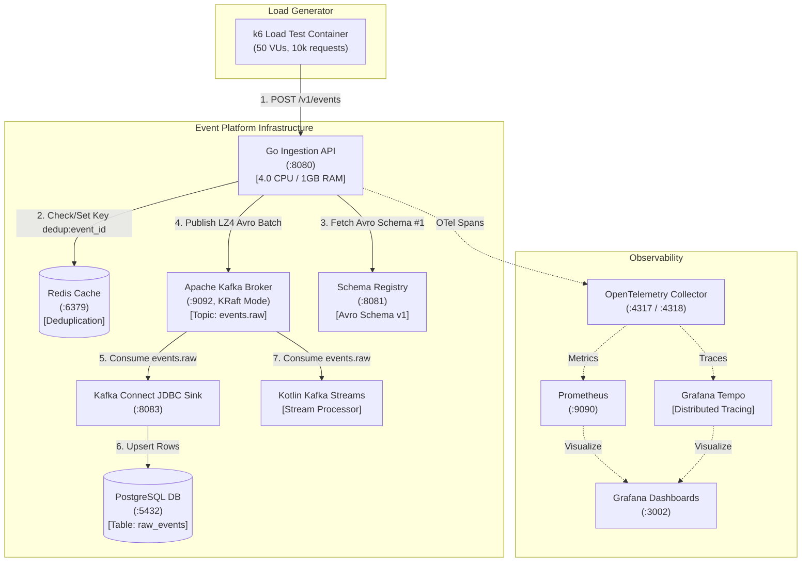

# High-Throughput Event Ingestion & Stream Processing Pipeline

A high-performance event processing platform built to sustain high-throughput ingestion, zero-data-loss streaming, and real-time database archiving on minimum compute resources.

---

## 🏗 Architectural Overview & System Flow



---

## 🌐 Active Service Endpoints & Dashboards

### Web Interfaces & Dashboards
| Service | URL | Credentials / Notes |
|---|---|---|
| **Grafana Dashboards** | [http://localhost:3002](http://localhost:3002) | User: `admin` / Password: `admin` |
| **Prometheus UI** | [http://localhost:9090](http://localhost:9090) | Time-series metrics console |
| **pprof Profiler UI** | [http://localhost:6060/debug/pprof/](http://localhost:6060/debug/pprof/) | Live Go CPU & Memory profiling |

### API Endpoints
| Service | URL / Endpoint | Method | Description |
|---|---|---|---|
| **Ingestion Health** | [http://localhost:8080/healthz](http://localhost:8080/healthz) | `GET` | Health probe |
| **Ingestion Event API** | `http://localhost:8080/v1/events` | `POST` | Event entrypoint |
| **Schema Registry** | [http://localhost:8081/subjects](http://localhost:8081/subjects) | `GET` | Registered Avro schemas |
| **Kafka Connect API** | [http://localhost:8083/connectors](http://localhost:8083/connectors) | `GET` | Sink connector status |

### Streaming & Infrastructure Connection Specs
| Service | Endpoint | Connection Specs / Credentials |
|---|---|---|
| **Apache Kafka** | `localhost:9092` | Topics: `events.raw` (12 partitions), `events.enriched` (12 partitions) |
| **PostgreSQL DB** | `localhost:5432` | Database: `app` \| User: `app` \| Pass: `app` \| Table: `raw_events` |
| **Redis Cache** | `localhost:6379` | Key format: `dedup:<event_id>` (24h TTL) |
| **OTel Collector** | `localhost:4317` (gRPC) / `localhost:4318` (HTTP) | Distributed trace collector |

---

## 🛠 One-Step Environment Setup & Migrations

Run the automated developer setup script to start the stack, execute PostgreSQL schema migrations, provision Kafka topics, register Avro schemas, and attach Kafka Connect sinks:

```bash
./event-platform/scripts/setup-dev-environment.sh
```

---

## 🧪 Running Load Tests & Test Suite

### 1. 10K Request Load Test (k6 Container)
Executes 10,000 requests against the live pipeline:
```bash
docker run --rm --add-host=host.docker.internal:host-gateway \
  -v $(pwd)/event-platform/loadtest:/scripts \
  grafana/k6:latest run \
  --summary-export=/scripts/k6-results-10k.json \
  /scripts/ingestion_10k_loadtest.ts
```

### 2. Full Test Suite & HTML Report Generation
Runs Go unit, integration, and benchmark tests, generating consolidated HTML reports:
```bash
./event-platform/scripts/run-tests.sh
```

### 3. Automated Allure Pipeline Test
Runs end-to-end load tests and asserts database delivery in Postgres:
```bash
pytest event-platform/loadtest/test_ingestion_pipeline.py -k test_load_10k_requests -vs
```

---

## 📊 Performance Benchmarks & Optimization

| Optimization Phase | Decoding Latency (`BenchmarkDecodeRawEvent_500KB`) | Memory Allocation / Op | Heap Allocations / Op |
|---|---|---|---|
| **Baseline (`encoding/json.Decoder`)** | `9.73 ms - 10.59 ms` | `2.07 MB` (2,079,280 B) | `21 allocs/op` |
| **Optimized Direct Extraction (`jsonparser`)** | **`0.72 ms - 0.98 ms`** | **`40 Bytes`** | **`2 allocs/op`** |
| **Improvement** | **12.3x Speedup** | **99.997% Memory Drop** | **90.5% Allocation Drop** |

---

## 📄 HTML & Allure Test Reports

- **Interactive Allure Report:** [http://localhost:8088/allure_report_single.html/index.html](http://localhost:8088/allure_report_single.html/index.html)
- **Consolidated Test Report:** [`event-platform/reports/report.html`](file:///home/btpl-lap-22/live/messaging-pipeline/event-platform/reports/report.html)
