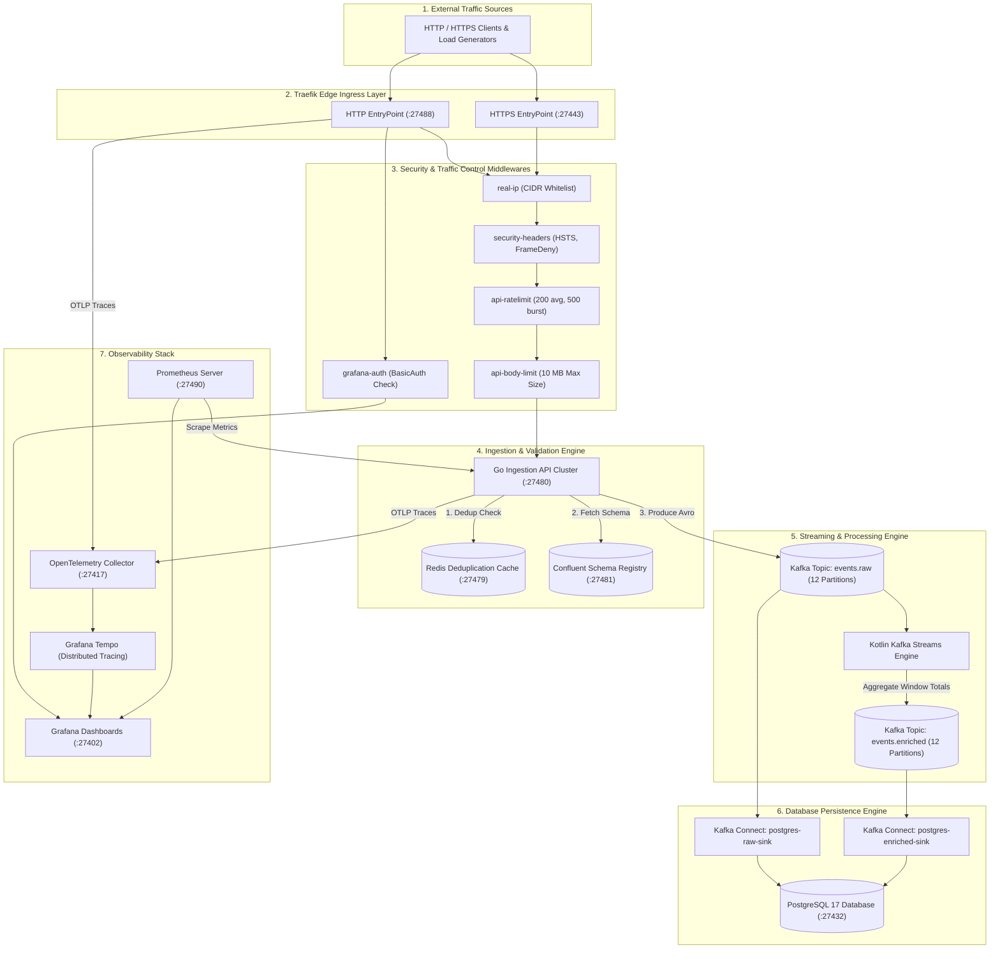
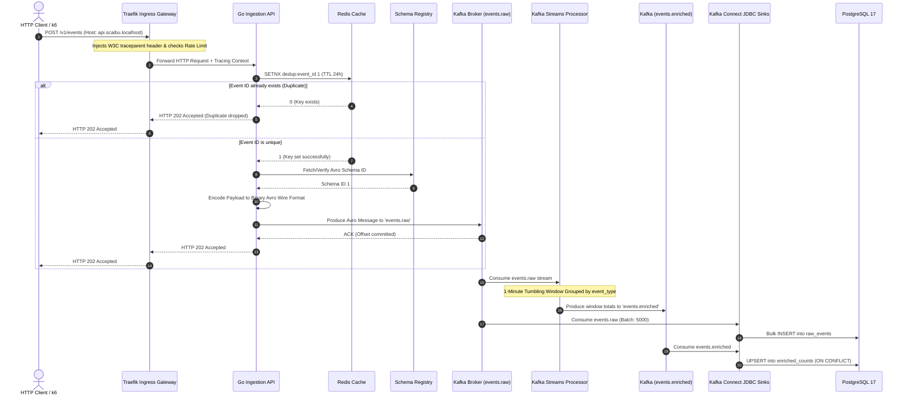
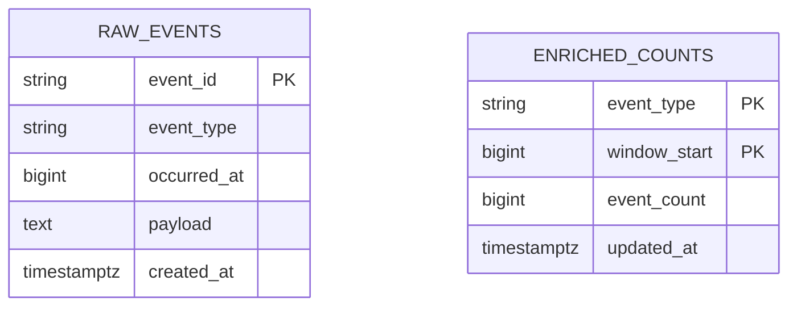

# High-Throughput Event Ingestion & Stream Processing Pipeline

A production-grade, enterprise-scale event processing platform built to sustain high-throughput ingestion, zero-data-loss streaming, real-time aggregation, and relational database archiving on minimum compute resources, reverse-proxied and secured by **Traefik v3**.

---

## 🏛️ 1. Comprehensive System Architecture

The event processing platform combines an edge reverse-proxy gateway, a high-performance Go ingestion service, in-memory deduplication, Kafka streaming, real-time windowed analytics, and automated database archiving.

### Overall Architecture Topology



---

## 🔄 2. End-to-End Event Lifecycle Sequence

The sequence diagram below traces a request from the edge ingress down to stream aggregation and database insertion:



---

## 🔒 3. Edge Ingress & Network Security Architecture (Traefik v3)

Traefik v3 operates as the single entry point for all edge traffic, managing domain routing, middleware enforcement, SSL termination, and basic authentication.

### Traefik Dynamic Routers & Rules

| Router Name | Host / Path Rule | Middleware Chain | Target Backend Service |
|---|---|---|---|
| `api-http` | `Host("api.scaibu.localhost")` | `real-ip`, `security-headers`, `api-ratelimit`, `api-body-limit` | `ingestion-api:8080` |
| `api-https` | `Host("api.scaibu.localhost") + TLS` | `real-ip`, `security-headers`, `api-ratelimit`, `api-body-limit` | `ingestion-api:8080` |
| `grafana-http` | `Host("grafana.scaibu.localhost")` | `real-ip`, `grafana-auth`, `security-headers` | `grafana:3000` |
| `traefik-dashboard` | `PathPrefix("/dashboard") \|\| PathPrefix("/api")` | `dashboard-auth` | `api@internal` |

### Security & Traffic Management Middlewares

1. **`real-ip` (IP Allow List)**: Restricts access to authorized client IP ranges (`127.0.0.1/8`, `10.0.0.0/8`, `172.16.0.0/12`, `192.168.0.0/16`).
2. **`security-headers`**: Mandates security HTTP response headers (`X-Frame-Options: DENY`, `X-Content-Type-Options: nosniff`, `Strict-Transport-Security`).
3. **`api-ratelimit`**: Enforces token-bucket rate limits (Average: `200 req/s`, Burst capacity: `500 req/s`).
4. **`api-body-limit`**: Caps maximum payload size at `10 MB` (`10,485,760 bytes`) to prevent memory overload attacks.
5. **`grafana-auth` / `dashboard-auth`**: Implements HTTP BasicAuth (`admin` / `Scaibu@123`) using bcrypt hashing.

---

## ⚡ 4. Messaging & Stream Processing Component Specifications

### 1. Go Ingestion Service (`ingestion-api`)
- **Language & Runtime**: Go 1.22
- **Framework & Libraries**: Gin Web Framework, Shopify Sarama Kafka Client, Go-Redis
- **Deduplication Strategy**: Atomic Redis `SETNX dedup:<event_id> 1` with a 24-hour expiration.
- **Wire Format Encoding**: Confluent Avro wire format (`0x00` magic byte + 4-byte Schema ID + Avro binary data).
- **Producer Configuration**: LZ4 compression, 12-partition round-robin distribution, `acks=all` for zero data loss.

### 2. Stream Processor (`stream-processor`)
- **Language & Runtime**: Kotlin 1.9 / JVM 21
- **Framework**: Kafka Streams API
- **Windowing Topology**: 1-minute tumbling windows grouped by `event_type`.
- **Output Topic**: `events.enriched` containing window start timestamp, event type, and total event count.

### 3. Kafka KRaft Cluster
- **Broker Version**: Apache Kafka 3.7+ (KRaft mode enabled, no ZooKeeper requirement).
- **Partitioning Strategy**: 12 partitions per topic for horizontal consumer scalability.

---

## 💾 5. Persistence & Relational Database Schema

### Database Configuration
- **Engine**: PostgreSQL 17
- **Database**: `app` | **User**: `app` | **Password**: `Scaibu@123`

### Entity Relationship Diagram (ERD)



### Table Definitions & Indexing Strategy

```sql
-- Raw Events Table (High-volume insert sink)
CREATE TABLE IF NOT EXISTS raw_events (
    event_id VARCHAR(255) PRIMARY KEY,
    event_type VARCHAR(255) NOT NULL,
    occurred_at BIGINT NOT NULL,
    payload TEXT NOT NULL,
    created_at TIMESTAMPTZ DEFAULT CURRENT_TIMESTAMP
);

CREATE INDEX IF NOT EXISTS idx_raw_events_event_type ON raw_events(event_type);
CREATE INDEX IF NOT EXISTS idx_raw_events_occurred_at ON raw_events(occurred_at);

-- Enriched Window Counts Table (Real-time aggregation sink)
CREATE TABLE IF NOT EXISTS enriched_counts (
    event_type VARCHAR(255) NOT NULL,
    window_start BIGINT NOT NULL,
    event_count BIGINT NOT NULL,
    updated_at TIMESTAMPTZ DEFAULT CURRENT_TIMESTAMP,
    PRIMARY KEY (event_type, window_start)
);

CREATE INDEX IF NOT EXISTS idx_enriched_counts_window ON enriched_counts(window_start);
```

---

## 🔍 6. Distributed Tracing & Observability Guide

The infrastructure utilizes OpenTelemetry auto-instrumentation and manual span propagation linked to Grafana Tempo and Grafana Dashboards.

### How to Inspect Distributed Traces in Grafana

1. Open Grafana at [http://grafana.scaibu.localhost:27488](http://grafana.scaibu.localhost:27488) (or direct port `http://localhost:27402`).
2. Log in with Username `admin` and Password `Scaibu@123`.
3. Select **Explore** from the left navigation panel.
4. Set the datasource dropdown to **Tempo**.
5. Filter by service `ingestion-api` to inspect execution timing breakdown per HTTP request.

---

## 🌐 7. Complete Network Port & Service Mapping

| Service | Container Internal Port | Dedicated Host Bound Port | Protocol | Purpose / Description |
|---|---|---|---|---|
| **Traefik Ingress (HTTP)** | `80` | `27488` | HTTP | Main public HTTP gateway entry |
| **Traefik Ingress (HTTPS)** | `443` | `27443` | HTTPS | Secured TLS entry point |
| **Ingestion API Cluster** | `8080` | `27480` | HTTP | Go event ingestion service endpoint |
| **PostgreSQL 17** | `5432` | `27432` | TCP / SQL | Primary database server |
| **Redis Cache** | `6379` | `27479` | TCP | Deduplication memory cache |
| **Kafka Broker** | `9092` | `27492` | TCP | Messaging broker external port |
| **Schema Registry** | `8081` | `27481` | HTTP | Confluent Avro Schema Registry |
| **Kafka Connect** | `8083` | `27483` | HTTP | JDBC Sink Connectors API |
| **Prometheus Server** | `9090` | `27490` | HTTP | Time-series metrics dashboard |
| **Grafana Dashboards** | `3000` | `27402` | HTTP | Metrics & Tempo Traces visualization |
| **OTel Collector gRPC** | `4317` | `27417` | gRPC | OpenTelemetry trace receiver |
| **OTel Collector HTTP** | `4318` | `27418` | HTTP | OpenTelemetry HTTP metrics/spans |

---

## 🛠️ 8. Operational Commands & Environment Setup

### 1. Full Environment Setup Script
Executes dependency checks, environment variable rendering, container startup, database migrations, topic creation, and sink connector registrations with exponential backoff:

```bash
./event-platform/scripts/setup-dev-environment.sh
```

### 2. Run Test Suite
Executes unit tests, integration tests, and benchmark validations:

```bash
./event-platform/scripts/run-tests.sh
```

### 3. Execute Traefik Load Testing via k6
Runs high-throughput scenario tests against `http://api.scaibu.localhost:27488/v1/events`:

```bash
docker run --rm --network host \
  -v $(pwd)/event-platform/loadtest:/scripts \
  grafana/k6:latest run \
  --summary-export=/scripts/k6-results-10k.json \
  /scripts/traefik_integration.ts
```
