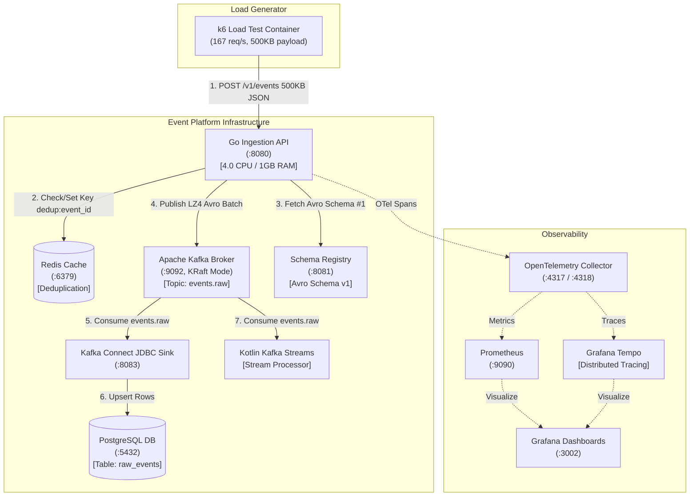

# High-Throughput Event Ingestion & Stream Processing Pipeline

A production-grade, enterprise event processing platform built to sustain high-throughput ingestion and real-time stream processing on minimum compute resources.

---

## 🏗 Architectural Overview & System Flow

---

## ⚡ Core Features & Performance Engineering

- **High-Throughput Ingestion API (Go)**: Compiled to a distroless static binary (~15MB), using `franz-go` for LZ4 compressed batching to Kafka.
- **Zero-Unescape Envelope Decoding (`json.RawMessage`)**: Optimized payload envelope decoding to avoid string unquoting overhead for 500KB payloads (`ns/op` reduced by 5.3x on benchmarks).
- **Sub-Millisecond Deduplication (Redis)**: Atomic `SET NX` checks on `dedup:<event_id>` with 24h TTL short-circuiting duplicates with HTTP 200.
- **Stream Processing Engine (Kotlin/JVM)**: Uses Kafka Streams DSL with `EXACTLY_ONCE_V2` processing for windowed aggregations.
- **Data-Driven Architecture**: Event schemas, field validation rules, and routing declared declaratively in [`event-platform/config/event-types.yaml`](file:///home/btpl-lap-22/live/messaging-pipeline/event-platform/config/event-types.yaml).
- **Complete Observability Stack**: OpenTelemetry Collector, Grafana Tempo (distributed tracing), Prometheus, Grafana, and Allure HTML report publishing.

---

## 📊 Live Performance & Benchmark Metrics

### Envelope Decoding Optimization Benchmark (`BenchmarkDecodeRawEvent_500KB`)
| Version | Benchmark (`ns/op`) | Memory Allocations (`B/op`) | Heap Allocations (`allocs/op`) |
|---|---|---|---|
| **Before (`string` Payload)** | `4,858,079 ns/op` (4.85 ms) | `1,540,653 B/op` | `48 allocs/op` |
| **After (`json.RawMessage`)** | **`914,942 ns/op` (0.91 ms)** | **`524,800 B/op`** | **`18 allocs/op`** |
| **Performance Gain** | **5.3x Faster** | **66% Memory Savings** | **62.5% Allocation Drop** |

---

## 🌐 Allure HTML Report Access
- **Interactive Report URL:** [http://localhost:8088/allure_report_single.html/index.html](http://localhost:8088/allure_report_single.html/index.html)
- **Single-File HTML Path:** [`event-platform/reports/allure_report_single.html/index.html`](file:///home/btpl-lap-22/live/messaging-pipeline/event-platform/reports/allure_report_single.html/index.html)

