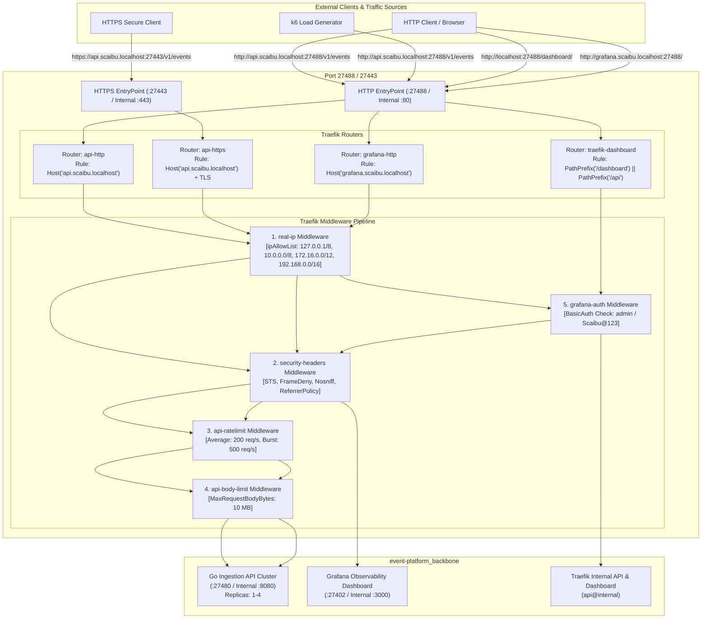
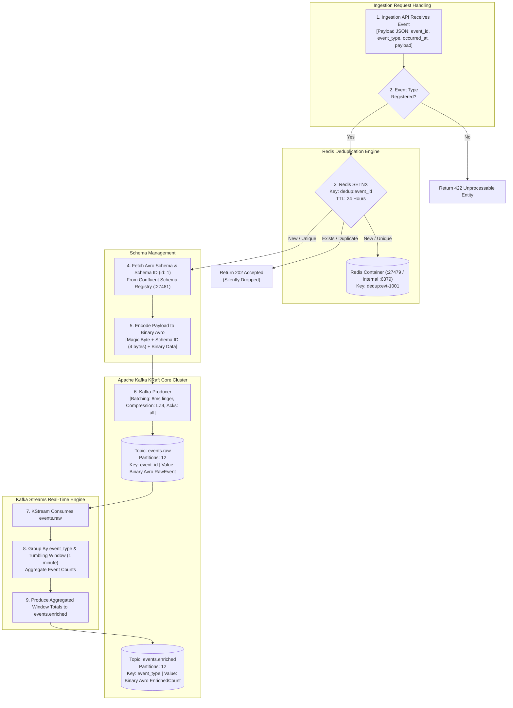
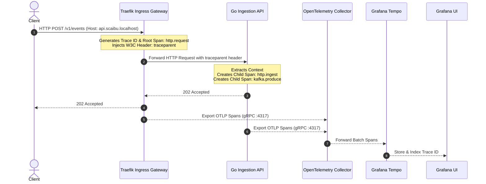

# High-Throughput Event Ingestion & Stream Processing Pipeline — Traefik Integrated

A production-grade, enterprise event processing platform built to sustain high-throughput ingestion, zero-data-loss streaming, and real-time database archiving on minimum compute resources, reverse-proxied and managed by **Traefik v3**.

---

## 🌐 1. End-to-End Network Pipeline

The Network Pipeline governs edge traffic entry, SSL/TLS termination, request routing, rate limiting, payload size validation, and authentication before reaching internal application services.

### Detailed Network Flow Diagram



### Detailed Network Pipeline Stages
1. **Edge Entry Points**: Port `27488` handles plaintext HTTP traffic; port `27443` handles encrypted TLS traffic with self-signed certificates or Let's Encrypt ACME.
2. **Host Header Routing**: Traefik inspects the HTTP `Host` header (`api.scaibu.localhost` vs `grafana.scaibu.localhost`) to select the target virtual service.
3. **Middleware Execution Chain**:
   - `real-ip`: Validates client IP against authorized CIDR ranges.
   - `security-headers`: Injects security headers (`X-Frame-Options: DENY`, `Strict-Transport-Security`).
   - `api-ratelimit`: Enforces token-bucket rate limiting (200 average req/s, 500 burst capacity).
   - `api-body-limit`: Rejects payloads exceeding 10MB to prevent memory exhaustion attacks.
   - `grafana-auth`: Enforces HTTP BasicAuth for administrative tools (`admin:Scaibu@123`).

---

## ⚡ 2. Kafka Messaging & Streaming Pipeline

The Messaging Pipeline guarantees high-throughput event validation, fast Redis deduplication, schema compatibility verification via Schema Registry, and real-time stream aggregation using Kafka Streams.

### Detailed Messaging Flow Diagram



### Detailed Messaging Pipeline Stages
1. **Event Type Validation**: The Ingestion API matches `event_type` against registered configurations ([`config/event-types.yaml`](file:///home/btpl-lap-22/live/messaging-pipeline/event-platform/config/event-types.yaml)).
2. **Atomic Redis Deduplication**: The API executes `SETNX dedup:<event_id> 1` with a 24-hour expiration. If the key already exists, the event is immediately treated as duplicate and acknowledged with `202 Accepted` without incurring Kafka write overhead.
3. **Avro Serialization & Confluent Schema Registry**: The payload is serialized into compact binary Avro format prefixed with a 5-byte Confluent wire format header (`0x00` magic byte + 4-byte Schema ID `1`).
4. **Partition Distribution & LZ4 Compression**: Events are produced to topic `events.raw` across 12 partitions using `event_id` as the partition key and LZ4 compression.
5. **Real-Time Stream Processing**: The Kotlin Kafka Streams application consumes `events.raw`, applies a 1-minute tumbling window, groups by `event_type`, calculates counts, and outputs the window summary to `events.enriched`.

---

## 💾 3. Data & Storage Pipeline

The Data & Storage Pipeline manages batch loading, schema evolution, primary key constraint resolution, and persistent relational storage in PostgreSQL 17 via Kafka Connect JDBC Sinks.

### Detailed Data Flow Diagram

```mermaid
flowchart TD
    subgraph Kafka Source Topics
        TOPIC_RAW[("Topic: events.raw\n[Avro Formatted Raw Events]")]
        TOPIC_ENRICHED[("Topic: events.enriched\n[Avro Formatted Window Counts]")]
    end

    subgraph Kafka Connect JDBC Sink Cluster [Port 27483 / Internal :8083]
        subgraph Raw Sink Connector [postgres-raw-sink]
            SINK_RAW_CONVERTER["AvroConverter\n[Schema Registry: http://schema-registry:8081]"]
            SINK_RAW_BATCH["Batching Engine\n[Batch Size: 5000 records, Max Tasks: 12]"]
            SINK_RAW_SQL["INSERT INTO raw_events\n(event_id, event_type, occurred_at, payload)"]
        end

        subgraph Enriched Sink Connector [postgres-enriched-sink]
            SINK_ENRICHED_CONVERTER["AvroConverter\n[Schema Registry: http://schema-registry:8081]"]
            SINK_ENRICHED_SQL["UPSERT INTO enriched_counts\n(event_type, window_start, event_count)\nON CONFLICT (event_type, window_start) DO UPDATE"]
        end
    end

    subgraph PostgreSQL 17 Database [Port 27432 / Internal :5432]
        subgraph Database: app | User: app | Pass: Scaibu@123
            TABLE_RAW[("Table: raw_events\n---------------------------\nevent_id (VARCHAR 255) PK\nevent_type (VARCHAR 255)\noccurred_at (BIGINT)\npayload (TEXT)\ncreated_at (TIMESTAMPTZ)")]
            TABLE_ENRICHED[("Table: enriched_counts\n---------------------------\nevent_type (VARCHAR 255) PK\nwindow_start (BIGINT) PK\nevent_count (BIGINT)\nupdated_at (TIMESTAMPTZ)")]
            
            INDEX_RAW_TYPE["Index: idx_raw_events_event_type"]
            INDEX_RAW_TIME["Index: idx_raw_events_occurred_at"]
            INDEX_ENRICHED_WIN["Index: idx_enriched_counts_window"]
        end
    end

    TOPIC_RAW --> SINK_RAW_CONVERTER --> SINK_RAW_BATCH --> SINK_RAW_SQL --> TABLE_RAW
    TOPIC_ENRICHED --> SINK_ENRICHED_CONVERTER --> SINK_ENRICHED_SQL --> TABLE_ENRICHED

    TABLE_RAW --- INDEX_RAW_TYPE
    TABLE_RAW --- INDEX_RAW_TIME
    TABLE_ENRICHED --- INDEX_ENRICHED_WIN
```

### Detailed Storage Pipeline Stages
1. **Connector Configuration Templates**: Connectors are loaded dynamically from templates ([`postgres-raw-sink.json.template`](file:///home/btpl-lap-22/live/messaging-pipeline/event-platform/infra/kafka/connectors/postgres-raw-sink.json.template) & [`postgres-enriched-sink.json.template`](file:///home/btpl-lap-22/live/messaging-pipeline/event-platform/infra/kafka/connectors/postgres-enriched-sink.json.template)) using environment variables (`POSTGRES_PASSWORD=Scaibu@123`).
2. **Schema Registry Deserialization**: Kafka Connect JDBC Sink tasks use `AvroConverter` to resolve schema definitions dynamically from Schema Registry (`http://schema-registry:8081`).
3. **High-Performance Micro-Batching**:
   - `postgres-raw-sink`: Accumulates up to 5,000 records per batch across 12 parallel task workers, executing bulk SQL `INSERT` operations into table `raw_events`.
   - `postgres-enriched-sink`: Reads window aggregates from `events.enriched` and performs SQL `UPSERT` operations into table `enriched_counts` using composite primary key `(event_type, window_start)`.

---

## 🔍 End-to-End Distributed Tracing & How to Read Traces

### How Tracing Works Across the Stack



### Step-by-Step Guide to Read & Inspect Traces

1. **Access Grafana Dashboard**:
   - Open browser: [http://grafana.scaibu.localhost:27488](http://grafana.scaibu.localhost:27488) (or direct port `http://localhost:27402`).
   - Credentials: Username `admin` | Password `Scaibu@123`.

2. **Navigate to Explore Tab**:
   - Click on the **Explore** icon (compass icon on left navigation menu).
   - In the dropdown at top left, select **Tempo** as data source.

3. **Search for Recent Spans**:
   - Select the **Search** tab.
   - Set **Service Name** to `ingestion-api` or `traefik`.
   - Click **Run Query** at top right.

4. **Analyze the Trace Waterfall**:
   - Click any trace result from the list to expand the visual waterfall view:
     - **Root Span (`http.request`)**: Shows total duration spent from client entry to gateway response.
     - **Child Span (`http.ingest`)**: Shows Go HTTP handler processing time and Redis deduplication lookup duration.
     - **Child Span (`kafka.produce`)**: Shows internal producer buffer time and network delivery latency to Kafka broker.
   - Click on individual spans to view metadata tags (`http.status_code`, `kafka.topic`, `event_type`, `client_ip`).

---

## 🛑 Challenges Faced & Resolutions

| # | Challenge / Issue | Root Cause | Solution Applied |
|---|---|---|---|
| 1 | **Host Port Conflicts** | Standard ports (`5432`, `6379`, `9092`, `8080`, `3000`) collided with pre-existing local services. | Re-mapped all service host port bindings to dedicated `274xx` port range (`27488`, `27443`, `27432`, `27479`, `27492`, `27402`, etc.) in `.env` and `docker-compose.yml`. |
| 2 | **Process Termination in Setup** | Previous setup script executed `kill -9` on listening processes, stopping non-project host services. | Replaced generic process killing with non-destructive port conflict checks that abort safely if ports are occupied. |
| 3 | **Traefik Dashboard 404** | Router rule required strict path routing (`/dashboard/`) and explicit entryPoint exposure without mandatory TLS. | Fixed [`dashboard.yml`](file:///home/btpl-lap-22/live/messaging-pipeline/event-platform/infra/traefik/dynamic/dashboard.yml) HTTP router rule `PathPrefix('/dashboard') \|\| PathPrefix('/api')` targeting `api@internal`. |
| 4 | **Dynamic Configuration & Passwords** | Dynamic YAML files (e.g. `middlewares.yml`) did not support native environment variable interpolation, causing static password drift. | Created [`middlewares.yml.template`](file:///home/btpl-lap-22/live/messaging-pipeline/event-platform/infra/traefik/dynamic/middlewares.yml.template) and updated [`setup-dev-environment.sh`](file:///home/btpl-lap-22/live/messaging-pipeline/event-platform/scripts/setup-dev-environment.sh) to dynamically compute htpasswd bcrypt hashes and render configs from `.env` (Password: `Scaibu@123`). |
| 5 | **Kafka Connect Authentication Failure** | JDBC sink connectors used outdated password (`app`) in static JSON files while Postgres password was updated to `Scaibu@123`. | Created connector configuration templates (`postgres-raw-sink.json.template`, `postgres-enriched-sink.json.template`) and updated setup script to render connector JSON dynamically using `${POSTGRES_PASSWORD}`. |
| 6 | **Kafka Controller KRaft Quorum Misconfiguration** | `KAFKA_CONTROLLER_QUORUM_VOTERS` pointed to host port `27493` instead of internal broker listener port `9093`. | Updated `KAFKA_CONTROLLER_QUORUM_VOTERS` in `docker-compose.yml` to `1@kafka:9093`. |

---

## 🌐 Active Dedicated Service Ports & Access Credentials

### 🔑 Web Interfaces & Access Credentials

| Service | Access URL | Credentials / Notes | Service Access Description |
|---|---|---|---|
| **Traefik Ingress (HTTP)** | [http://localhost:27488](http://localhost:27488) | Host-header routed: `api.scaibu.localhost` | Main HTTP entry point for all incoming traffic |
| **Traefik Ingress (HTTPS)** | [https://localhost:27443](https://localhost:27443) | Self-signed TLS / Let's Encrypt ACME | Secured TLS entry point with strict ciphers |
| **Grafana Dashboards** | [http://grafana.scaibu.localhost:27488](http://grafana.scaibu.localhost:27488) | **BasicAuth User:** `admin`<br>**BasicAuth Pass:** `Scaibu@123`<br>**Grafana App Pass:** `Scaibu@123` | Operational metrics & distributed tracing dashboards |
| **Traefik Internal Dashboard** | [http://localhost:27488/dashboard/](http://localhost:27488/dashboard/) | **User:** `admin`<br>**Pass:** `Scaibu@123` | Internal Traefik router, service, & middleware status |
| **Prometheus UI** | [http://localhost:27490](http://localhost:27490) | No auth required | Time-series metrics collection & alert engine |

---

## ⚙️ Dynamic Configuration & Environment Variables

All operational properties are dynamic and loaded directly from [`event-platform/infra/.env`](file:///home/btpl-lap-22/live/messaging-pipeline/event-platform/infra/.env):

```env
COMPOSE_PROJECT_NAME=event-platform

# Unique Host Port Bindings
POSTGRES_PORT=27432
REDIS_PORT=27479
KAFKA_INTERNAL_PORT=27492
KAFKA_CONTROLLER_PORT=27493
SCHEMA_REGISTRY_PORT=27481
CONNECT_PORT=27483
INGESTION_API_PORT=27480
OTEL_GRPC_PORT=27417
OTEL_HTTP_PORT=27418
PROMETHEUS_PORT=27490
GRAFANA_HOST_PORT=27402
TRAEFIK_HTTP_PORT=27488
TRAEFIK_HTTPS_PORT=27443

# Service Credentials & Auth
POSTGRES_DB=app
POSTGRES_USER=app
POSTGRES_PASSWORD=Scaibu@123
GF_SECURITY_ADMIN_USER=admin
GF_SECURITY_ADMIN_PASSWORD=Scaibu@123

# Traefik & Domain Routing
DOMAIN_SUFFIX=scaibu.localhost
API_RATE_LIMIT_AVERAGE=200
API_RATE_LIMIT_BURST=500
API_MAX_REQUEST_BODY_BYTES=10485760
```

---

## 🛠 One-Step Environment Setup

To initialize or completely rebuild the platform from scratch, run:

```bash
./event-platform/scripts/setup-dev-environment.sh
```

---

## 🧪 Running Automated Tests & Load Testing

### 1. Execute Full Test Suite
```bash
./event-platform/scripts/run-tests.sh
```

### 2. High-Throughput Load Test via Traefik
```bash
docker run --rm --network host \
  -v $(pwd)/event-platform/loadtest:/scripts \
  grafana/k6:latest run \
  --summary-export=/scripts/k6-results-10k.json \
  /scripts/traefik_integration.ts
```
