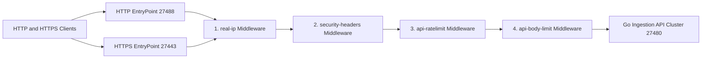
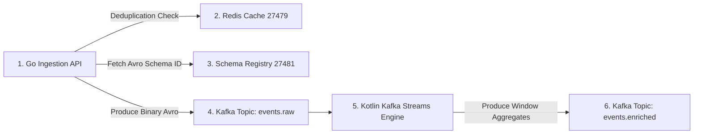
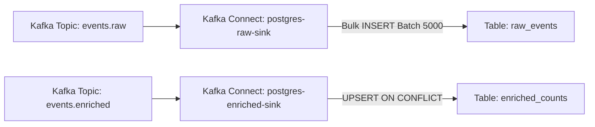
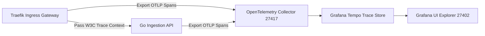
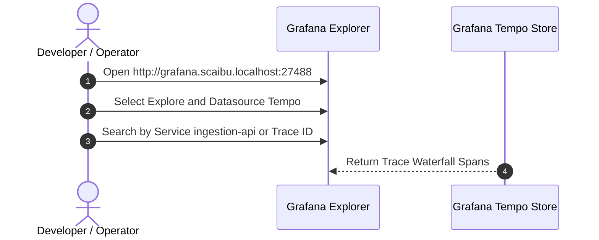

# High-Throughput Event Ingestion & Stream Processing Pipeline — Traefik Integrated

A production-grade, enterprise event processing platform built to sustain high-throughput ingestion, zero-data-loss streaming, and real-time database archiving on minimum compute resources, reverse-proxied and managed by **Traefik v3**.

---

## 🌐 1. Network Pipeline

The Network Pipeline governs edge traffic entry, SSL/TLS termination, request routing, rate limiting, payload size validation, and authentication before reaching internal application services.

### Network Flow Diagram



### Network Pipeline Stages
1. **Edge Entry Points**: Port `27488` handles plaintext HTTP traffic; port `27443` handles encrypted TLS traffic.
2. **Host Header Routing**: Traefik inspects the HTTP `Host` header (`api.scaibu.localhost` vs `grafana.scaibu.localhost`) to select target services.
3. **Middleware Execution Chain**:
   - `real-ip`: Validates client IP against authorized CIDR ranges.
   - `security-headers`: Injects security response headers (`X-Frame-Options: DENY`, `Strict-Transport-Security`).
   - `api-ratelimit`: Enforces token-bucket rate limiting (200 average req/s, 500 burst capacity).
   - `api-body-limit`: Rejects payloads exceeding 10MB to prevent memory exhaustion.

---

## ⚡ 2. Messaging Pipeline

The Messaging Pipeline guarantees high-throughput event validation, fast Redis deduplication, schema compatibility verification via Schema Registry, and real-time stream aggregation using Kafka Streams.

### Messaging Flow Diagram



### Messaging Pipeline Stages
1. **Event Type Validation**: The Ingestion API matches `event_type` against registered configurations.
2. **Atomic Redis Deduplication**: The API executes `SETNX dedup:<event_id> 1` with a 24-hour expiration. Duplicates receive an immediate `202 Accepted` response.
3. **Avro Serialization**: The payload is encoded in binary Avro format prefixed with a 5-byte Confluent wire format header.
4. **Kafka Partitioning**: Events are produced to topic `events.raw` across 12 partitions using `event_id` as the partition key.
5. **Real-Time Stream Processing**: The Kotlin Kafka Streams application applies a 1-minute tumbling window, groups by `event_type`, calculates counts, and outputs window summaries to `events.enriched`.

---

## 💾 3. Data Pipeline

The Data Pipeline manages batch loading, schema evolution, primary key constraint resolution, and persistent relational storage in PostgreSQL 17 via Kafka Connect JDBC Sinks.

### Data Flow Diagram



### Storage Pipeline Stages
1. **Connector Configuration**: Connectors are rendered dynamically from templates using environment variables (`POSTGRES_PASSWORD=Scaibu@123`).
2. **Schema Registry Deserialization**: Kafka Connect JDBC Sink tasks use `AvroConverter` to resolve schema definitions dynamically.
3. **Micro-Batch Persistence**:
   - `postgres-raw-sink`: Accumulates up to 5,000 records per batch across 12 parallel tasks into table `raw_events`.
   - `postgres-enriched-sink`: Reads window aggregates and performs SQL `UPSERT` operations into table `enriched_counts` using composite primary key `(event_type, window_start)`.

---

## 🔍 4. Tracing Pipeline

The Tracing Pipeline extracts W3C trace context at the edge gateway, propagates trace IDs through service invocations, and collects distributed spans into Grafana Tempo.

### Tracing Flow Diagram



---

## 📊 5. How to Read & Inspect Traces

### Trace Reading Diagram



### Step-by-Step Trace Inspection Guide
1. **Access Grafana Dashboard**:
   - URL: [http://grafana.scaibu.localhost:27488](http://grafana.scaibu.localhost:27488) (or direct port `http://localhost:27402`).
   - Credentials: Username `admin` | Password `Scaibu@123`.

2. **Navigate to Explore Tab**:
   - Click the **Explore** icon (compass icon on left menu).
   - In the dropdown at top left, select **Tempo** as data source.

3. **Search for Recent Spans**:
   - Select the **Search** tab.
   - Set **Service Name** to `ingestion-api` or `traefik`.
   - Click **Run Query** at top right.

4. **Analyze the Trace Waterfall**:
   - Click any trace result to expand the visual waterfall view:
     - **Root Span (`http.request`)**: Total duration spent from edge entry to response.
     - **Child Span (`http.ingest`)**: Go HTTP handler processing time and Redis deduplication lookup duration.
     - **Child Span (`kafka.produce`)**: Internal producer buffer time and network delivery latency to Kafka broker.

---

## 🛑 6. Challenges Faced & Resolutions

| # | Challenge / Issue | Root Cause | Solution Applied |
|---|---|---|---|
| 1 | **Host Port Conflicts** | Standard ports (`5432`, `6379`, `9092`, `8080`, `3000`) collided with local services. | Re-mapped host ports to dedicated `274xx` range (`27488`, `27443`, `27432`, `27479`, `27492`, `27402`). |
| 2 | **Process Termination in Setup** | Previous setup executed `kill -9` on listening processes. | Replaced process killing with non-destructive port availability checks. |
| 3 | **Traefik Dashboard 404** | Router rule required path routing (`/dashboard/`) targeting internal API. | Fixed [`dashboard.yml`](file:///home/btpl-lap-22/live/messaging-pipeline/event-platform/infra/traefik/dynamic/dashboard.yml) HTTP router rule `PathPrefix('/dashboard') \|\| PathPrefix('/api')`. |
| 4 | **Dynamic Config Interpolation** | Dynamic YAML files did not support environment variable interpolation. | Created templates (`middlewares.yml.template`) and updated setup script to render configs dynamically. |
| 5 | **Kafka Connect Auth Failure** | Sink connectors used outdated password (`app`) instead of `Scaibu@123`. | Created connector templates rendered dynamically using `${POSTGRES_PASSWORD}` during setup. |

---

## 🌐 7. Dedicated Ports & Credentials

| Service | Access URL | Credentials / Notes |
|---|---|---|
| **Traefik Ingress (HTTP)** | [http://localhost:27488](http://localhost:27488) | Host-header routed: `api.scaibu.localhost` |
| **Traefik Ingress (HTTPS)** | [https://localhost:27443](https://localhost:27443) | Self-signed TLS / Let's Encrypt ACME |
| **Grafana Dashboards** | [http://grafana.scaibu.localhost:27488](http://grafana.scaibu.localhost:27488) | User: `admin` \| Pass: `Scaibu@123` |
| **Traefik Dashboard** | [http://localhost:27488/dashboard/](http://localhost:27488/dashboard/) | User: `admin` \| Pass: `Scaibu@123` |
| **Prometheus UI** | [http://localhost:27490](http://localhost:27490) | No auth required |

---

## 🛠 8. Execution Commands

### Environment Setup
```bash
./event-platform/scripts/setup-dev-environment.sh
```

### Run Test Suite
```bash
./event-platform/scripts/run-tests.sh
```

### Run Load Testing
```bash
docker run --rm --network host \
  -v $(pwd)/event-platform/loadtest:/scripts \
  grafana/k6:latest run \
  --summary-export=/scripts/k6-results-10k.json \
  /scripts/traefik_integration.ts
```
