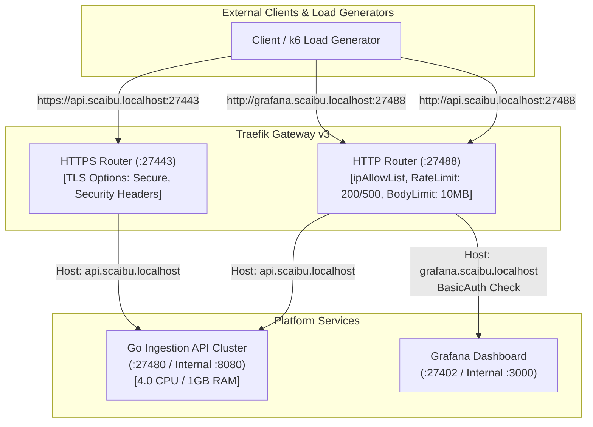
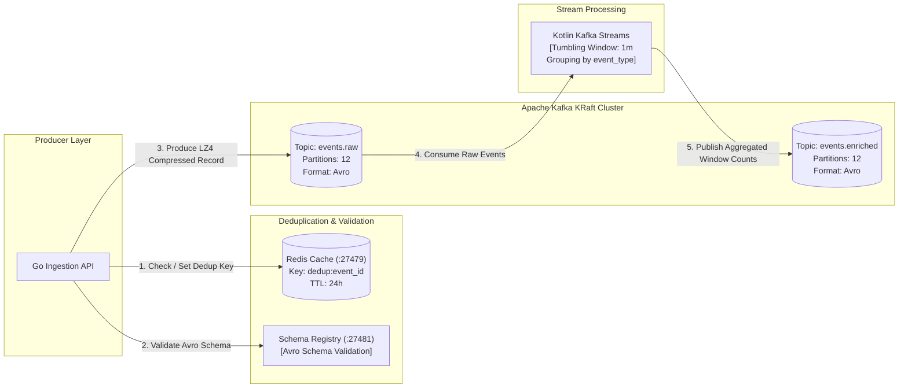
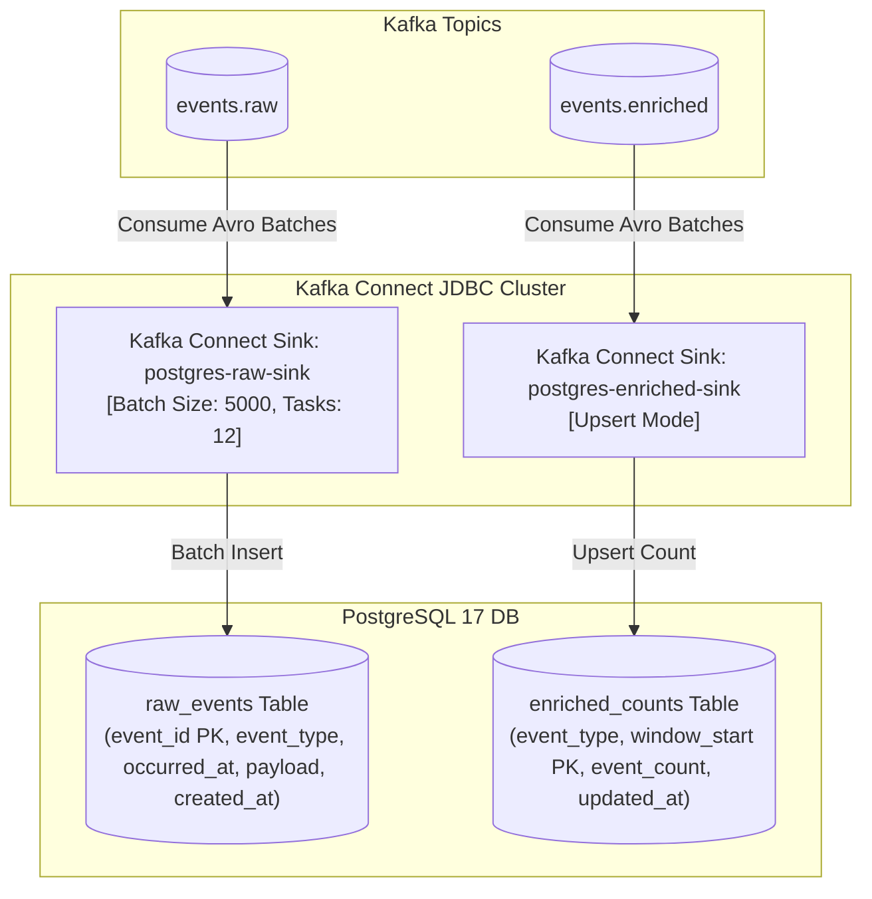

# High-Throughput Event Ingestion & Stream Processing Pipeline — Traefik Integrated

A production-grade, enterprise event processing platform built to sustain high-throughput ingestion, zero-data-loss streaming, and real-time database archiving on minimum compute resources, reverse-proxied and managed by **Traefik v3**.

---

## 🏗 Architectural Overview & Pipelines

The platform is designed around three distinct, decoupled architecture pipelines: **End-to-End Network Pipeline**, **Kafka Messaging Pipeline**, and **Data & Storage Pipeline**.

### 1. End-to-End Network Pipeline



---

### 2. Kafka Messaging & Streaming Pipeline



---

### 3. Data & Storage Pipeline



---

## 🔍 End-to-End Distributed Tracing & How to Read Traces

### How Tracing Works
Every incoming HTTP request is automatically injected with an OpenTelemetry (OTel) `traceparent` context header at the **Traefik Ingress Gateway**:
1. **Traefik Ingress**: Initiates the root span `http.request` and records client IP, request path, status code, and latency.
2. **Go Ingestion API**: Extracts context from incoming headers, creates child spans `http.ingest` and `kafka.produce`, and records Redis deduplication latencies.
3. **OpenTelemetry Collector**: Receives gRPC spans on port `27417` and forwards them to **Grafana Tempo**.
4. **Grafana & Prometheus**: Provide instant visual trace waterfall correlation.

### How to Inspect Traces Step-by-Step
1. Open Grafana at [http://grafana.scaibu.localhost:27488](http://grafana.scaibu.localhost:27488) (or direct port `http://localhost:27402`).
2. Log in with Username `admin` and Password `Scaibu@123`.
3. Go to **Explore** (left sidebar compass icon) -> Select Data Source **Tempo**.
4. Click **Search** tab:
   - **Service Name**: `ingestion-api` or `traefik`
   - Click **Run Query**.
5. Click on any Trace ID to open the **Trace Waterfall View**:
   - Inspect total duration and per-span breakdown (`http.ingest` vs `kafka.produce`).
   - Click individual spans to view attributes (`http.status_code`, `kafka.topic`, `event_type`).

---

## 🛑 Challenges Faced & Resolutions

| # | Challenge / Issue | Root Cause | Solution Applied |
|---|---|---|---|
| 1 | **Host Port Conflicts** | Standard ports (`5432`, `6379`, `9092`, `8080`, `3000`) collided with existing local services on developer machine. | Re-mapped all service host port bindings to dedicated `274xx` port range (`27488`, `27443`, `27432`, `27479`, `27492`, `27402`, etc.) in `.env` and `docker-compose.yml`. |
| 2 | **Process Killing in Setup Script** | Previous setup script executed `kill -9` on listening processes, disrupting non-project host services. | Replaced generic process termination with non-destructive port conflict checks that abort safely if ports are occupied. |
| 3 | **Traefik Dashboard 404** | Router rule required strict path routing (`/dashboard/`) and explicit entryPoint exposure without mandatory TLS. | Fixed [`dashboard.yml`](file:///home/btpl-lap-22/live/messaging-pipeline/event-platform/infra/traefik/dynamic/dashboard.yml) HTTP router rule `PathPrefix('/dashboard') \|\| PathPrefix('/api')` targeting `api@internal`. |
| 4 | **Dynamic Configuration & Passwords** | Dynamic YAML files (e.g. `middlewares.yml`) did not support native environment variable interpolation, causing static password drift. | Created [`middlewares.yml.template`](file:///home/btpl-lap-22/live/messaging-pipeline/event-platform/infra/traefik/dynamic/middlewares.yml.template) and updated [`setup-dev-environment.sh`](file:///home/btpl-lap-22/live/messaging-pipeline/event-platform/scripts/setup-dev-environment.sh) to dynamically compute htpasswd bcrypt hashes and render configs from `.env` (Password: `Scaibu@123`). |
| 5 | **Kafka Connect Authentication Failure** | JDBC sink connectors used outdated password (`app`) in static JSON files while Postgres password was updated to `Scaibu@123`. | Created connector configuration templates (`postgres-raw-sink.json.template`, `postgres-enriched-sink.json.template`) and updated setup script to render connector JSON dynamically using `${POSTGRES_PASSWORD}`. |
| 6 | **Kafka Controller KRaft Quorum Misconfiguration** | `KAFKA_CONTROLLER_QUORUM_VOTERS` pointed to host port `27493` instead of internal broker listener port `9093`. | Updated `KAFKA_CONTROLLER_QUORUM_VOTERS` in `docker-compose.yml` to `1@kafka:9093`. |

---

## 🌐 Active Dedicated Service Ports & Access Credentials

All host ports are assigned to a dedicated **`274xx` unique port range** to avoid conflicts.

### 🔑 Web Interfaces & Access Credentials

| Service | Access URL | Credentials / Notes | Service Access Description |
|---|---|---|---|
| **Traefik Ingress (HTTP)** | [http://localhost:27488](http://localhost:27488) | Host-header routed: `api.scaibu.localhost` | Main HTTP entry point for all incoming traffic |
| **Traefik Ingress (HTTPS)** | [https://localhost:27443](https://localhost:27443) | Self-signed TLS / Let's Encrypt ACME | Secured TLS entry point with strict ciphers |
| **Grafana Dashboards** | [http://grafana.scaibu.localhost:27488](http://grafana.scaibu.localhost:27488) | **BasicAuth User:** `admin`<br>**BasicAuth Pass:** `Scaibu@123`<br>**Grafana App Pass:** `Scaibu@123` | Operational metrics & distributed tracing dashboards |
| **Traefik Internal Dashboard** | [http://localhost:27488/dashboard/](http://localhost:27488/dashboard/) | **User:** `admin`<br>**Pass:** `Scaibu@123` | Internal Traefik router, service, & middleware status |
| **Prometheus UI** | [http://localhost:27490](http://localhost:27490) | No auth required | Time-series metrics collection & alert engine |

---

## ⚙️ Dynamic Configuration & Environment Variables

All operational properties are dynamic and loaded directly from [`event-platform/infra/.env`](file:///home/btpl-lap-22/live/messaging-pipeline/event-platform/infra/.env):

```env
COMPOSE_PROJECT_NAME=event-platform

# Unique Host Port Bindings
POSTGRES_PORT=27432
REDIS_PORT=27479
KAFKA_INTERNAL_PORT=27492
KAFKA_CONTROLLER_PORT=27493
SCHEMA_REGISTRY_PORT=27481
CONNECT_PORT=27483
INGESTION_API_PORT=27480
OTEL_GRPC_PORT=27417
OTEL_HTTP_PORT=27418
PROMETHEUS_PORT=27490
GRAFANA_HOST_PORT=27402
TRAEFIK_HTTP_PORT=27488
TRAEFIK_HTTPS_PORT=27443

# Service Credentials & Auth
POSTGRES_DB=app
POSTGRES_USER=app
POSTGRES_PASSWORD=Scaibu@123
GF_SECURITY_ADMIN_USER=admin
GF_SECURITY_ADMIN_PASSWORD=Scaibu@123

# Traefik & Domain Routing
DOMAIN_SUFFIX=scaibu.localhost
API_RATE_LIMIT_AVERAGE=200
API_RATE_LIMIT_BURST=500
API_MAX_REQUEST_BODY_BYTES=10485760
```

---

## 🛠 One-Step Environment Setup

To initialize or completely rebuild the platform from scratch, run:

```bash
./event-platform/scripts/setup-dev-environment.sh
```

---

## 🧪 Running Automated Tests & Load Testing

### 1. Execute Full Test Suite
```bash
./event-platform/scripts/run-tests.sh
```

### 2. High-Throughput Load Test via Traefik
```bash
docker run --rm --network host \
  -v $(pwd)/event-platform/loadtest:/scripts \
  grafana/k6:latest run \
  --summary-export=/scripts/k6-results-10k.json \
  /scripts/traefik_integration.ts
```
