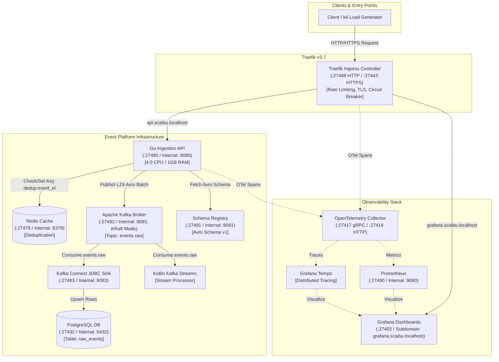

# High-Throughput Event Ingestion & Stream Processing Pipeline — Traefik Integrated

A production-grade, enterprise event processing platform built to sustain high-throughput ingestion, zero-data-loss streaming, and real-time database archiving on minimum compute resources, reverse-proxied and managed by **Traefik v3**.

---

## 🏗 Architectural Overview & System Flow



---

## 🌐 Active Dedicated Service Ports & Access Credentials

All host ports have been assigned to a dedicated **`274xx` unique port range** to avoid any port conflicts with pre-existing local services or default system processes.

### 🔑 Web Interfaces & Access Credentials

| Service | Access URL | Credentials / Notes | Service Access Description |
|---|---|---|---|
| **Traefik Ingress (HTTP)** | [http://localhost:27488](http://localhost:27488) | Host-header routed: `api.scaibu.localhost` | Main HTTP entry point for all incoming traffic |
| **Traefik Ingress (HTTPS)** | [https://localhost:27443](https://localhost:27443) | Self-signed TLS / Let's Encrypt ACME | Secured TLS entry point with strict ciphers |
| **Grafana Dashboards** | [http://grafana.scaibu.localhost:27488](http://grafana.scaibu.localhost:27488) | **BasicAuth User:** `admin`<br>**BasicAuth Pass:** `admin_password_event_platform`<br>**Grafana App Pass:** `admin_password_event_platform` | Operational metrics & distributed tracing dashboards |
| **Traefik Internal Dashboard** | [http://traefik.scaibu.localhost:27488/dashboard/](http://traefik.scaibu.localhost:27488/dashboard/) | **User:** `admin`<br>**Pass:** `admin_password_event_platform` | Internal Traefik router, service, & middleware status |
| **Prometheus UI** | [http://localhost:27490](http://localhost:27490) | No auth required | Time-series metrics collection & alert engine |
| **pprof Profiler UI** | [http://localhost:6060/debug/pprof/](http://localhost:6060/debug/pprof/) | Development build | Live Go runtime CPU, heap & goroutine profiling |

### 🔌 Service API Endpoints & Transport Specs

| Service | URL / Host Port | Method / Protocol | Description & Authentication |
|---|---|---|---|
| **Ingestion Health Probe** | `http://api.scaibu.localhost:27488/healthz` | `GET` | Ingestion API health check endpoint |
| **Ingestion Event API** | `http://api.scaibu.localhost:27488/v1/events` | `POST` | Primary high-throughput event ingestion endpoint |
| **PostgreSQL 17 Database** | `localhost:27432` | PostgreSQL Protocol | **DB:** `app` \| **User:** `app` \| **Pass:** `app` |
| **Redis 7 Cache** | `localhost:27479` | RESP Protocol | No password (internal dedup cache `dedup:<event_id>`) |
| **Apache Kafka Broker** | `localhost:27492` | PLAINTEXT | KRaft broker listening on port 27492 (internal 9092) |
| **Confluent Schema Registry** | `http://localhost:27481/subjects` | HTTP `GET` | Avro schema manager on port 27481 |
| **Kafka Connect API** | `http://localhost:27483/connectors` | HTTP `GET`/`POST` | JDBC Sink connector management API |
| **OpenTelemetry Collector** | `localhost:27417` (gRPC) / `localhost:27418` (HTTP) | OTLP | Multi-tenant metric & trace ingestion collector |

---

## ⚙️ Dynamic Configuration & Environment Variables

All operational properties are dynamic and loaded directly from [`event-platform/infra/.env`](file:///home/btpl-lap-22/live/messaging-pipeline/event-platform/infra/.env). You can customize ports, credentials, limits, or domains without modifying code:

```env
COMPOSE_PROJECT_NAME=event-platform

# Unique Host Port Bindings
POSTGRES_PORT=27432
REDIS_PORT=27479
KAFKA_INTERNAL_PORT=27492
KAFKA_CONTROLLER_PORT=27493
SCHEMA_REGISTRY_PORT=27481
CONNECT_PORT=27483
INGESTION_API_PORT=27480
OTEL_GRPC_PORT=27417
OTEL_HTTP_PORT=27418
PROMETHEUS_PORT=27490
GRAFANA_HOST_PORT=27402
TRAEFIK_HTTP_PORT=27488
TRAEFIK_HTTPS_PORT=27443

# Service Credentials & Auth
POSTGRES_DB=app
POSTGRES_USER=app
POSTGRES_PASSWORD=app
GF_SECURITY_ADMIN_USER=admin
GF_SECURITY_ADMIN_PASSWORD=admin_password_event_platform

# Traefik & Domain Routing
DOMAIN_SUFFIX=scaibu.localhost
API_RATE_LIMIT_AVERAGE=200
API_RATE_LIMIT_BURST=500
API_MAX_REQUEST_BODY_BYTES=10485760
```

---

## 🛠 One-Step Environment Setup

To initialize or completely rebuild the platform from scratch (cleans previous containers and data volumes while preserving existing system services), run:

```bash
./event-platform/scripts/setup-dev-environment.sh
```

---

## 🧪 Running Automated Tests & Load Testing

### 1. Execute Full Test Suite
```bash
./event-platform/scripts/run-tests.sh
```

### 2. High-Throughput Load Test via Traefik
```bash
docker run --rm --network host \
  -v $(pwd)/event-platform/loadtest:/scripts \
  grafana/k6:latest run \
  --summary-export=/scripts/k6-results-10k.json \
  /scripts/ingestion_10k_loadtest.ts
```

---

## 📄 Test Reports & Analytics

- **Consolidated Test Suite HTML Report:** [`event-platform/reports/report.html`](file:///home/btpl-lap-22/live/messaging-pipeline/event-platform/reports/report.html)
- **Allure Interactive Test Report:** [http://localhost:8088/allure_report_single.html/index.html](http://localhost:8088/allure_report_single.html/index.html)
