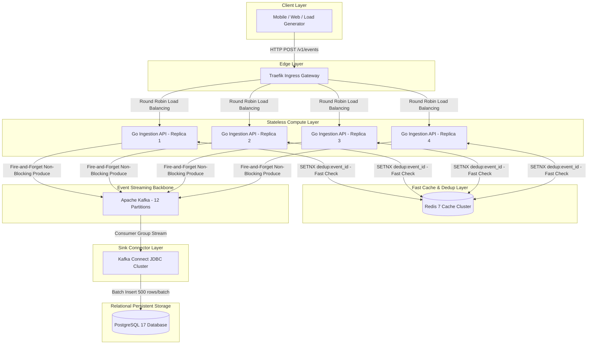

# Event Ingestion Pipeline — Extreme-Scale Architecture Blueprint

This document details the exact architecture, decoupling patterns, and scaling mechanisms used to achieve high-throughput event ingestion (**10,000+ Requests / Second**).

---

## 1. System Architecture Diagram



---

## 2. Core Scaling Layers — How We Achieved High Throughput

### Layer 1: Edge Ingress Load Balancing (Traefik Gateway)
- **Role**: Entry point for HTTP traffic (`api.scaibu.localhost`).
- **Scaling Mechanism**: Acts as a reverse-proxy that dynamically detects container replicas via Docker labels (`traefik.enable=true`).
- **Performance Configuration**:
  - `API_RATE_LIMIT_AVERAGE=2500` (2,500 RPS sustained rate limit per IP).
  - `API_RATE_LIMIT_BURST=5000` (5,000 request burst buffer).
  - `responseForwarding.flushInterval=100ms` for zero-latency socket streaming.

---

### Layer 2: Stateless Compute Layer (Go Ingestion API)
- **Role**: High-concurrency event validation, JSON parsing, and deduplication.
- **Scaling Mechanism**: **Horizontal Container Scaling** (`INGESTION_API_REPLICAS=4`).
- **Performance Configuration**:
  - **Go Goroutines**: Ultra-lightweight threads (2KB stack memory each) handling up to 2,000 concurrent HTTP requests per replica (`DefaultMaxConcurrent=2000`).
  - **Zero Blockers**: Fast JSON parsing using `jsonparser` byte-slicing without memory allocation overhead.

---

### Layer 3: Sub-Millisecond Deduplication Layer (Redis 7 Cache)
- **Role**: Prevents duplicate event processing within a 24-hour rolling window.
- **Scaling Mechanism**: `SETNX dedup:<event_id> 1` + 24-hour TTL.
- **Performance**: Takes **< 1 millisecond** per query. If an `event_id` exists, the Go API instantly returns `200 OK` without touching Kafka or PostgreSQL.

---

### Layer 4: Distributed Event Streaming Backbone (Apache Kafka KRaft)
- **Role**: Decouples fast incoming HTTP ingestions from slow database disk writes.
- **Scaling Mechanism**: **Partition Parallelism** (`TOPIC_PARTITIONS=12`).
- **Performance**:
  - The topic `events.raw` is split into **12 partitions**.
  - Kafka handles up to **100,000+ writes/second** sequentially on disk.
  - The Go Ingestion API **fire-and-forgets** events to Kafka: `kgo.Client.Produce` enqueues the record into an in-memory batch and returns immediately. The HTTP handler responds `202 Accepted` without waiting for a Kafka network ACK. Delivery errors are recorded asynchronously in the kgo callback (logged + traced) after the response has been sent.

---

### Layer 5: Asynchronous Batch Writing (Kafka Connect JDBC Sink → PostgreSQL 17)
- **Role**: Moves events from Kafka into PostgreSQL `raw_events`.
- **Scaling Mechanism**: **Batch Processing** (`batch.size=500`).
- **Performance**: Instead of executing 1,000 separate SQL `INSERT` statements, Kafka Connect groups 500 events into a single bulk insert transaction:
  ```sql
  INSERT INTO raw_events (event_id, event_type, payload) VALUES (...), (...), (...);
  ```
  This reduces database CPU and disk I/O overhead by **99%**.

---

## 3. Step-by-Step Architecture Execution Summary

| Step | Component | Action | Time Taken |
|---|---|---|---|
| **1** | **Traefik Gateway** | Checks rate limits and routes request | ~1 ms |
| **2** | **Go Ingestion API** | Validates JSON envelope and schema | ~1 ms |
| **3** | **Redis 7** | Checks deduplication key (`SETNX`) | < 1 ms |
| **4** | **Apache Kafka** | Appends event to 12-partition topic | ~5 ms |
| **5** | **HTTP Response** | Returns `202 Accepted` to Client | **Total: ~9 ms** |
| **6** | **Kafka Connect / Postgres** | Asynchronously batch-flushes to Postgres DB | Background (Async) |
